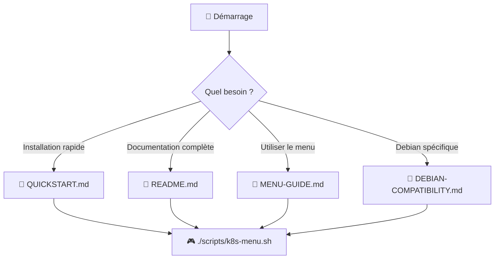

# 📁 Structure du Projet

## Vue d'ensemble

```
kubernetes-ha-setup/
├── 📚 Documentation
├── ⚙️ Configuration
├── 🔧 Scripts d'installation
└── 📄 Exemples
```

## 📂 Structure détaillée

```
kubernetes-ha-setup/
│
├── 📚 DOCUMENTATION (à lire en premier)
│   ├── README.md                          ⭐ Documentation principale complète
│   ├── QUICKSTART.md                      ⚡ Installation rapide (10 minutes)
│   ├── MENU-GUIDE.md                      📱 Guide du menu interactif
│   ├── CONFIGURATION-GUIDE.md             ⚙️ Guide de configuration détaillé
│   ├── DEBIAN-COMPATIBILITY.md            🐧 Guide Debian 12/13
│   └── PROJECT-STRUCTURE.md               📁 Ce fichier
│
├── 📖 DOCUMENTATION DÉTAILLÉE
│   └── docs/
│       ├── README.md                      📚 Guide des docs détaillées
│       ├── Installation Kubernetes 1.32.txt   📖 Guide complet pas à pas
│       └── Configuration HA avec keepalived.txt
│
├── ⚙️ CONFIGURATION
│   ├── kubelet-ha.yaml                    📝 Config du cluster (référence)
│   ├── .gitignore                         🚫 Fichiers exclus de Git
│   └── scripts/config.sh                  🎯 CONFIGURATION CENTRALISÉE
│
├── 🔧 SCRIPTS D'INSTALLATION
│   └── scripts/
│       ├── k8s-menu.sh                    🎮 MENU INTERACTIF PRINCIPAL ⭐
│       │
│       ├── 🏗️ Installation de base
│       │   ├── common-setup.sh            (Tous les nœuds)
│       │   ├── master-setup.sh            (Masters)
│       │   ├── worker-setup.sh            (Workers)
│       │   └── setup-keepalived.sh        (HA avec keepalived)
│       │
│       ├── 🚀 Cluster
│       │   ├── init-cluster.sh            (Initialisation)
│       │   └── install-calico.sh          (Réseau CNI)
│       │
│       └── 🧩 Add-ons
│           ├── install-metallb.sh         (Load Balancer)
│           ├── install-rancher.sh         (Interface Web)
│           └── install-monitoring.sh      (Prometheus + Grafana)
│
└── 📄 EXEMPLES
    └── examples/
        ├── README.md                      📖 Documentation des exemples
        ├── cAdvisor.yaml                  🔍 Exemple DaemonSet monitoring
        ├── metallb-config.yaml            ⚖️ Exemple config MetalLB
        ├── values.yaml                    📊 Exemple config Prometheus
        └── prometheus-grafana-service.yaml 📈 Exemple service Grafana
```

## 📖 Guide d'utilisation des fichiers

### 🎯 Par où commencer ?



### 📚 Documentation (ordre de lecture)

1. **README.md** - Commencez ici pour une vue d'ensemble complète
2. **QUICKSTART.md** - Si vous voulez installer rapidement
3. **MENU-GUIDE.md** - Pour maîtriser le menu interactif
4. **DEBIAN-COMPATIBILITY.md** - Seulement si vous utilisez Debian
5. **Installation Kubernetes 1.32.txt** - Guide détaillé traditionnel

### 🔧 Scripts (ordre d'exécution)

#### Installation complète automatique

```bash
./scripts/k8s-menu.sh
# Suivre l'assistant intégré
```

#### Installation manuelle étape par étape

```bash
# 1. Tous les nœuds
./scripts/common-setup.sh

# 2. Masters uniquement
./scripts/master-setup.sh
./scripts/setup-keepalived.sh

# 3. Premier master uniquement
./scripts/init-cluster.sh
./scripts/install-calico.sh

# 4. Add-ons (optionnel)
./scripts/install-metallb.sh
./scripts/install-rancher.sh
./scripts/install-monitoring.sh
```

### ⚙️ Configuration

#### Fichier principal : `scripts/config.sh`

**Modifier AVANT l'installation** :

```bash
nano scripts/config.sh
```

Variables importantes :
- `VIP` : IP virtuelle (192.168.0.200)
- `MASTER1_IP`, `MASTER2_IP`, `MASTER3_IP` : IPs des masters
- `METALLB_IP_RANGE` : Plage IP pour MetalLB
- `RANCHER_HOSTNAME` : Nom d'hôte Rancher
- `K8S_VERSION` : Version Kubernetes

#### Fichier de référence : `kubelet-ha.yaml`

Exemple de configuration Kubernetes HA.
**Généré automatiquement** par `init-cluster.sh` si absent.

### 📄 Exemples

Dossier `examples/` contient des fichiers YAML d'exemple :

⚠️ **Important** : Ces fichiers sont **automatiquement générés** par les scripts.
Vous n'avez **pas besoin** de les créer ou modifier manuellement.

**Utilité** :
- 📖 Référence pour comprendre les configurations
- 🎓 Apprentissage de Kubernetes
- 🔍 Vérification des paramètres

**NE PAS faire** :
```bash
❌ kubectl apply -f examples/metallb-config.yaml
```

**À faire** :
```bash
✅ ./scripts/install-metallb.sh
```

## 🎯 Fichiers générés (ignorés par Git)

Ces fichiers sont créés **automatiquement** lors de l'installation :

```
kubernetes-ha-setup/
├── kubeadm-init.log              # Log de l'initialisation du cluster
├── join-commands.txt             # Commandes kubeadm join
├── metallb-config.yaml           # Généré par install-metallb.sh
├── cadvisor.yaml                 # Généré par install-monitoring.sh
├── prometheus-values.yaml        # Généré par install-monitoring.sh
└── kubelet-ha.yaml               # Généré par init-cluster.sh (si absent)
```

Ces fichiers sont dans `.gitignore` et ne doivent **pas** être versionnés.

## 🔍 Trouver rapidement un fichier

| Je veux... | Fichier à consulter |
|------------|---------------------|
| Installer rapidement | `QUICKSTART.md` |
| Comprendre le menu | `MENU-GUIDE.md` |
| Modifier les IPs | `scripts/config.sh` |
| Lancer l'installation | `scripts/k8s-menu.sh` |
| Problème avec Debian | `DEBIAN-COMPATIBILITY.md` |
| Guide pas à pas | `Installation Kubernetes 1.32.txt` |
| Exemple de config MetalLB | `examples/metallb-config.yaml` |
| Comprendre keepalived | `Configuration HA avec keepalived.txt` |

## 📊 Statistiques du projet

```bash
# Nombre de scripts
ls scripts/*.sh | wc -l
# → 11 scripts

# Nombre de fichiers de documentation
ls *.md *.txt | wc -l
# → 7 documents

# Taille totale du projet
du -sh .
# → ~500 KB
```

## 🚀 Démarrage rapide

```bash
# 1. Cloner
git clone https://github.com/votre-user/kubernetes-ha-setup.git
cd kubernetes-ha-setup

# 2. (Optionnel) Personnaliser
nano scripts/config.sh

# 3. Lancer
cd scripts
./k8s-menu.sh
```

## 📝 Mise à jour du projet

Pour mettre à jour votre installation locale :

```bash
git pull origin main
chmod +x scripts/*.sh
```

## 🤝 Contribution

Si vous voulez contribuer :

1. Les **scripts** sont dans `scripts/`
2. La **documentation** est à la racine
3. Les **exemples** sont dans `examples/`
4. La **config** est dans `scripts/config.sh`

Avant de committer :
```bash
# Vérifier que les scripts sont exécutables
chmod +x scripts/*.sh

# Vérifier .gitignore
git status

# Ne pas committer les fichiers générés
```

## 🔒 Fichiers sensibles

**Ne JAMAIS committer** :
- ❌ `kubeadm-init.log` (contient des secrets)
- ❌ `join-commands.txt` (contient des tokens)
- ❌ `.kube/config` (credentials)
- ❌ Fichiers `*.pem`, `*.key` (clés privées)
- ❌ Dossier `secrets/`

Ces fichiers sont dans `.gitignore`.

## 📞 Support

- 📖 Documentation : Lire les fichiers `.md`
- 🐛 Bug : Ouvrir une issue sur GitHub
- 💬 Question : Consulter `MENU-GUIDE.md` ou `README.md`
- 🆘 Aide : Menu interactif → [6] Informations et aide

---

**Note** : Cette structure est optimisée pour la clarté et la facilité d'utilisation. Tous les fichiers importants sont à la racine ou dans `scripts/`.
